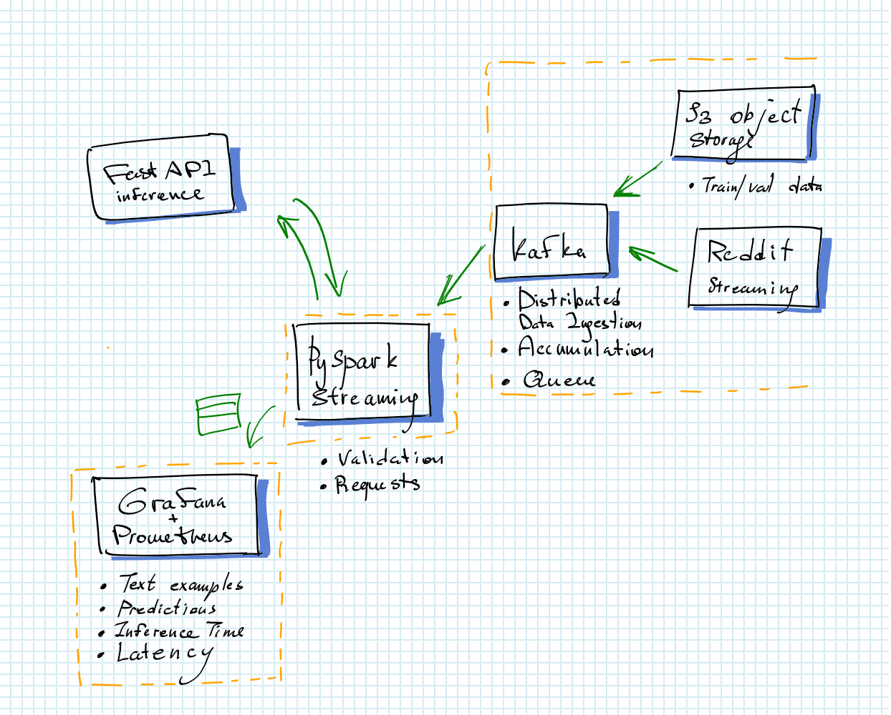

# toxic-messages-data-platform
Data platform
* Dashboard to review results of toxicity classification models by input text
* Streaming data from Reddit posts, S3-csv file (Yandex Obj. Storage)
* Storing them at the separate Kafka partitions
Used Pyspark, Kafka, Grafana and Prometheus for learning purposes.



## Usage

```bash
git config core.autocrlf true
git submodule update --init --recursive
docker-compose .
```